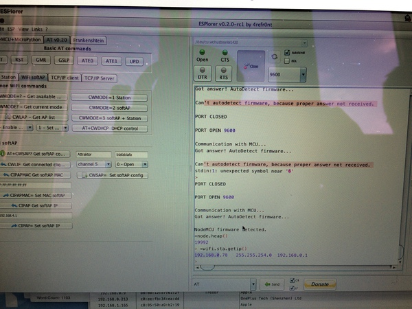
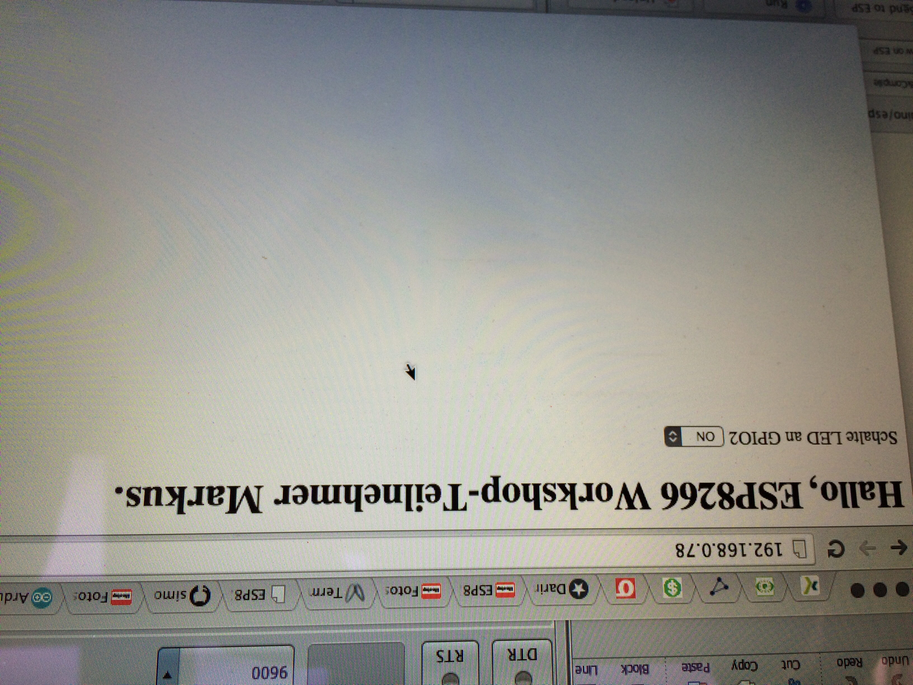
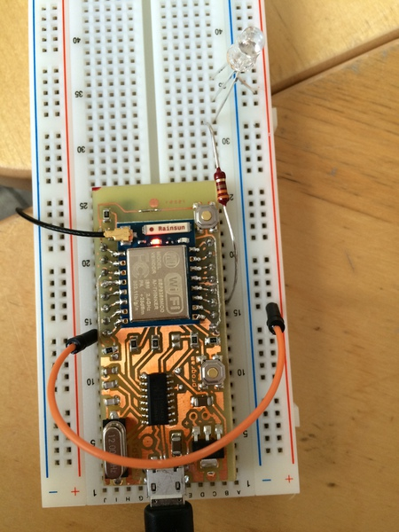
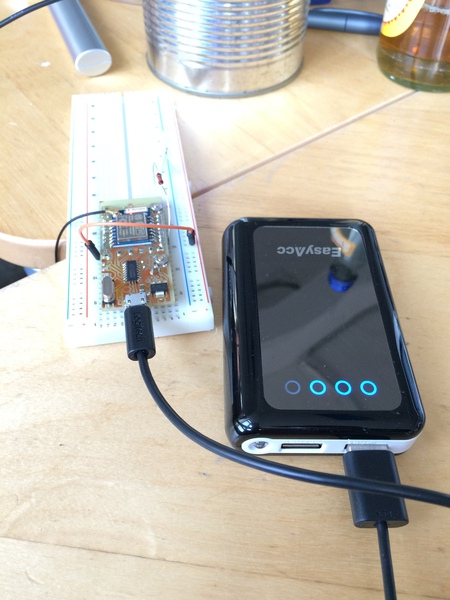

# ESP Workshop

Das sind meine Aufzeichnungen zu diesem Workshop am Apr 15 2015 im Attraktor eV: https://wiki.attraktor.org/Termin:ESP8266_Workshop 

Das ganze findet man auch auf Meetup (dort kommen die Fotos her): http://www.meetup.com/attraktor/events/221482638/ 

Das Etherpad dazu ist hier: https://pad.attraktor.org/p/ESP8266

## Vorbereitung (Mail von Markus)

Wenn Du mit der neuen ESP8266/ Arduino-IDE programmieren möchtest (daraus kann man das ESP8266-Modul über die Arduino IDE direkt programmieren), wäre es sinnvoll, wenn Du Dir (am besten kurz vor dem Workshop) eine aktuelle Version vom github herunterlädst: 

* https://github.com/esp8266/arduino 
* http://arduino.cc/en/Main/Software

Ansonsten brauchst Du Deinem Betriebssystem entsprechend noch folgende Software:

* ESPlorer: http://esp8266.ru/esplorer/#download

* NodeMCU-Flasher: https://github.com/nodemcu/nodemcu-flasher (nur Windows) alternativ esptool.py: https://github.com/themadinventor/esptool/

* NodeMCU-Firmware: https://github.com/nodemcu/nodemcu-firmware

## Dosenantenne bauen

Hier die Bilder:

## ESP-Bausatz

### Pinout

### ESP-07

Im ESP-Bausatz ist ein ESP-07 auf einem Steckbrett.

### OS X Yosemite Treiber

Die Treiber für den ESP gibt es hier:  http://www.wch.cn/downloads.php?name=pro&proid=5

Installiere den CH340-Treiber.

Führe das Kommando im Terminal aus: 

	sudo nvram boot-args="kext-dev-mode=1"

Starte den Rechner neu.

Dann sollte es ein neues Gerät geben:

	$ ls /dev/cu.*
	/dev/cu.wchusbserial1420

Anmerkung: Dann läuft auch ein PL2303 USB UART Adapter TTL-Pegel 3.3V / 5V mit dem Raspberry Pi.

## ESPlorer

Das Modul schließt man über Micro-USB an.

Nun kann man sich mit dem ESPlorer verbinden.
* /dev/cu.wchusbserial1420
* 9600 Baud! (oder 115200 Baud)

Dann kommt die Ausgabe:

	PORT OPEN 115200
	
	Communication with MCU...
	Got answer! AutoDetect firmware...
	
	Can't autodetect firmware, because proper answer not received.
	

## Firmware flashen

Auf \\\\Tesor (im Attraktor) liegt eine Datei <code>worshop_AT.bin</code> (auch hier in diesem Verzeichnis).

Außerdem braucht man die ESPTools: https://github.com/themadinventor/esptool.git

	$ sudo python setup.py install
	$ python esptool.py
	
Das Modul in den Flash-Zustand versetzen:

* Reset gedrückt halten
* Programmierbutton gedrückt halten
* Reset loslassen
* Programmierbutton loslassen
	
Dann kann man flashen:

	$ python esptool.py --port /dev/cu.wchusbserial1420 --baud 9600 write_flash 0x000000 ../esp-workshop/workshop_AT.bin
	
	Connecting...
	Erasing flash...
	.....
	Writing at 0x00066400... (100 %)
	
	Leaving...

Anmerkung: Theoretisch kann man die Baud-Rate auch weglassen.

Jetzt kommt man im ESPlorer wieder auf das Modul. Mit der neuen Firmware musste ich die Baud-Rate ändern auf 115200:

	AT-based firmware detected.
	AT+GMR
	
	00200.9.4
	compiled by Markus for ESP8266 workshop @ Apr 15 2015 09:17:02
	
	OK
	
Fine.

### Access-Point aufmachen

Über ESPlorer kann man AT-Kommandos absetzen. 

	AT
	
	OK
	

	AT+RST
	
	
	OK
	
	 ets Jan  8 2013,rst cause:4, boot mode:(3,7)
	
	wdt reset
	load 0x40100000, len 25628, room 16 
	tail 12
	chksum 0x72
	ho 0 tail 12 room 4
	load 0x3ffe8000, len 3476, room 12 
	tail 8
	chksum 0xea
	load 0x3ffe8da0, len 6716, room 0 
	tail 12
	chksum 0x58
	csum 0x58
	sd
	ready

Man kann die Liste aller Access-Points einsehen:

	AT+CWLAP

	+CWLAP:(0,"ESP_9B63EE",-59,"1a:fe:34:9b:63:ee",1)
	+CWLAP:(0,"AI-THINKER_9C0944",-54,"1a:fe:34:9c:09:44",1)
	+CWLAP:(0,"ESP_9B55C7",-33,"1a:fe:34:9b:55:c7",1)
	+CWLAP:(0,"AI-THINKER_9C089A",-54,"1a:fe:34:9c:08:9a",1)
	+CWLAP:(2,"testJakob",-65,"1a:fe:34:a0:a7:98",1)
	+CWLAP:(0,"AI-THINKER_9FDFBB",-72,"1a:fe:34:9f:df:bb",1)
	+CWLAP:(3,"Attraktor",-61,"0e:27:22:53:1e:f8",1)
	+CWLAP:(0,"AI-THINKER_9FDFD4",-66,"1a:fe:34:9f:df:d4",1)
	+CWLAP:(0,"hamburg.freifunk.net",-49,"fa:1c:68:ca:85:6a",1)
	+CWLAP:(0,"f8:d1:11:87:52:2e",-49,"fa:1d:68:ca:85:6a",1)
	+CWLAP:(4,"1.OG",-90,"0a:18:d6:4f:19:5b",1)
	+CWLAP:(0,"Hackerspace-Bremen",-46,"1a:fe:34:9c:09:9b",3)
	+CWLAP:(4,"1.OG",-72,"0a:18:d6:8d:cb:5c",6)
	+CWLAP:(4,"1.OG Gaeste",-81,"04:18:d6:8d:cb:5c",6)
	+CWLAP:(3,"Attraktor",-82,"24:a4:3c:17:c1:c2",6)
	+CWLAP:(3,"ADT GMBH 2",-91,"cc:b2:55:8c:3a:c0",6)
	+CWLAP:(3,"EZ-7330-SRV",-85,"34:31:c4:c6:b2:dc",8)
	+CWLAP:(3,"",-92,"c6:25:06:7c:52:1a",8)
	+CWLAP:(3,"E4-Root",-72,"00:1c:28:d8:21:df",10)
	+CWLAP:(3,"WLAN-239887",-71,"88:03:55:23:98:1d",11)
	+CWLAP:(3,"Attraktor",-40,"dc:9f:db:b5:3a:a2",11)
	+CWLAP:(4,"FRITZ!Box 6360 Cable",-85,"9c:c7:a6:a4:dd:dc",11)
	+CWLAP:(4,"Astra GmbH",-75,"00:1a:4f:1b:fe:b9",11)

	OK

Man kann einen Access-Point "AI-THINKER-OX" ohne Verschlüsselung aufmachen.

	AT+CWSAP="AI-THINKER-OX","",5,0

Mit diesem Netzwerk kann ich mich verbinden. Offene Ports gibt es auf dem ESP scheinbar keine.

	$ nmap -v 192.168.4.1
	
	Starting Nmap 6.47 ( http://nmap.org ) at 2015-04-18 17:31 CEST
	Initiating Ping Scan at 17:31
	Scanning 192.168.4.1 [2 ports]
	Completed Ping Scan at 17:31, 0.00s elapsed (1 total hosts)
	Initiating Parallel DNS resolution of 1 host. at 17:31
	Completed Parallel DNS resolution of 1 host. at 17:31, 13.00s elapsed
	Initiating Connect Scan at 17:31
	Scanning 192.168.4.1 [1000 ports]
	Completed Connect Scan at 17:31, 1.60s elapsed (1000 total ports)
	Nmap scan report for 192.168.4.1
	Host is up (0.0086s latency).
	All 1000 scanned ports on 192.168.4.1 are closed
	
	Read data files from: /usr/local/bin/../share/nmap
	Nmap done: 1 IP address (1 host up) scanned in 14.64 seconds

Allerdings funktioniert die Dosenantenne (getestet mit iStumbler) :-)

Man kann den ESP auch in ein Netzwerk hängen:

	AT+CWJAP="Attraktor","super*geheimes*passwort"
	OK

Man kann die Mac-Adresse holen:

	AT+CIPAPMAC?
	+CIPAPMAC:"1a:fe:34:9c:08:86"
	
	OK

## NodeMCU

### Firmware flashen

Für NodeMCU wird eine neue Firmware benötigt. Diese Firmware kommuniziert mit dem Controller. Dazu wird die neue Firmware "NodeMCU firmware" aufgespielt:

	$ python esptool.py --port /dev/cu.wchusbserial1420 write_flash 0x000000 ../esp-workshop/nodemcu_latest.bin
	Connecting...
	Erasing flash...
	Writing at 0x00062000... (100 %)
	
	Leaving...
	
### ESPlorer

Man kann sich dann wieder über ESPlorer verbinden. Es gibt eine neue Firmware.

	PORT OPEN 9600
	
	Communication with MCU...
	Got answer! AutoDetect firmware...
	
	NodeMCU firmware detected.
	=node.heap()
	19992
	
Jetzt kann man nicht nur über AT-Befehle mit dem ESP sprechen.

	=wifi.sta.getip()
	192.168.0.78	255.255.254.0	192.168.0.1




### Lua
Jetzt kann man mit LUA programmieren. Es gibt zwei Beispiele:
* init.lua		
* webap\_toggle\_pin.lua

**Da in diesen Scripts Passworte stehen, liegt es nicht in diesem Repo!**

Die eigene IP-Adresse ermitteln:

	=wifi.sta.getip()
	192.168.0.78	255.255.254.0	192.168.0.1

Auf die kann man sich mit einem Webbrowser connecten: http://192.168.0.78/

### LED

LED mit dem längsten Pin auf die rote +-Linie. Die anderen Pins (stehen für Red, Green, Blue) einfach so ins Steckbrett. Dann verbinden wie auf dem Foto zu sehen.

Dann kann man die LED über den Webserver steuern.

Das ganze läuft dann natürlich auch autark.

### Arduino LED

Wem Lua und der ESPlorer zu sperrig sind, der kann auch die Arduino-IDE verwenden und den ESP wie einen Arduino programmieren. Man sollte dazu eine eigene Arduino IDE verwenden, die bereits die benötigten Libraries etc. mitbringt. 

Die gibt es hier: https://github.com/esp8266/Arduino (nicht die Sourcen klonen sondern die Binaries runterladen).

Diese muss man konfigurieren. 

* Werkzeuge -> Platine -> ESP
* COM-Port
* Programmer: ESP-Tool

Leider funktioniert das bei mir (noch) nicht.

## Links
* ESP8266 Web Server Tutorial: http://randomnerdtutorials.com/esp8266-web-server/
* Installing and Building an Arduino Sketch for the $5 ESP8266 Microcontroller: http://makezine.com/2015/04/01/installing-building-arduino-sketch-5-microcontroller/

