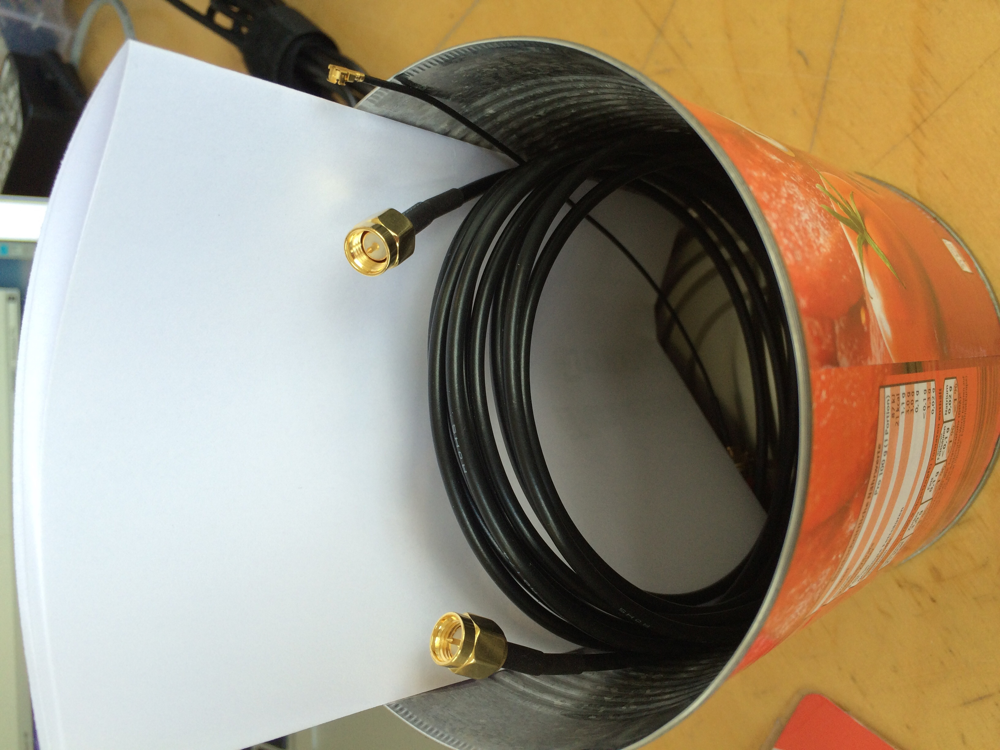
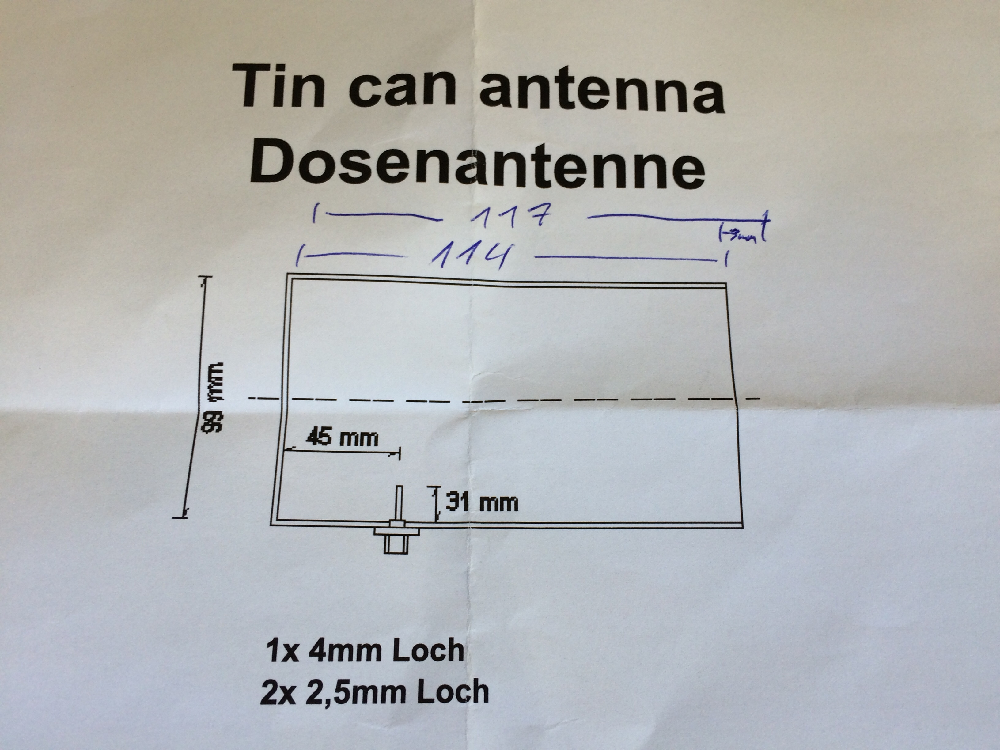
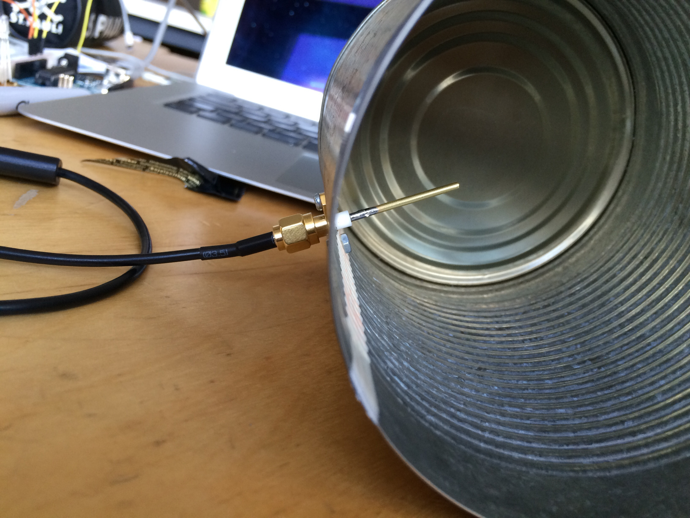
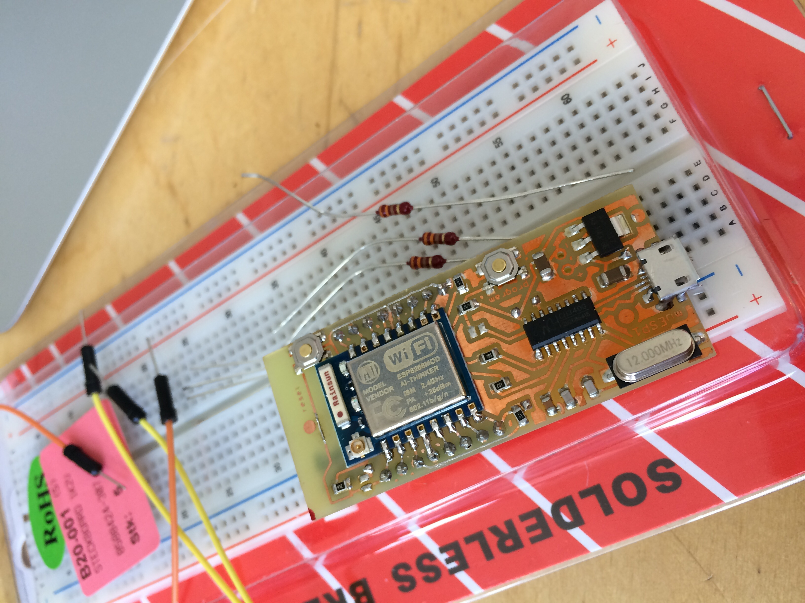
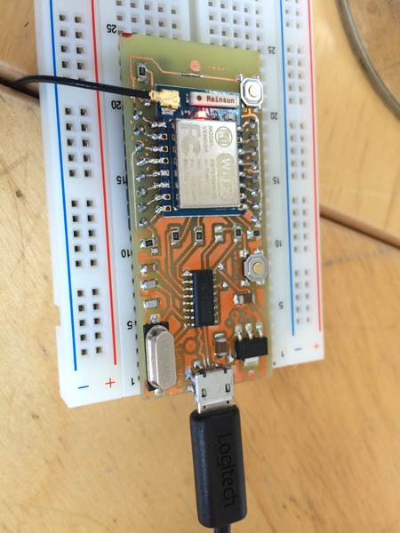

# ESP Workshop

Das sind meine Aufzeichnungen zu diesem Workshop am Apr 15 2015 im Attraktor eV: https://wiki.attraktor.org/Termin:ESP8266_Workshop 

Das ganze findet man auch auf Meetup (dort kommen die Fotos her): http://www.meetup.com/attraktor/events/221482638/ 

Das Etherpad dazu ist hier: https://pad.attraktor.org/p/ESP8266

## Vorbereitung

Wenn Du mit der neuen ESP8266/ Arduino-IDE programmieren möchtest (daraus kann man das ESP8266-Modul über die Arduino IDE direkt programmieren), wäre es sinnvoll, wenn Du Dir (am besten kurz vor dem Workshop) eine aktuelle Version vom github herunterlädst: 

* https://github.com/esp8266/arduino 
* http://arduino.cc/en/Main/Software

Ansonsten brauchst Du Deinem Betriebssystem entsprechend noch folgende Software:

* ESPlorer: http://esp8266.ru/esplorer/#download

* NodeMCU-Flasher: https://github.com/nodemcu/nodemcu-flasher (nur Windows) alternativ esptool.py: https://github.com/themadinventor/esptool/

* NodeMCU-Firmware: https://github.com/nodemcu/nodemcu-firmware

## Dosenantenne bauen

Hier die Bilder:

## ESP-Bausatz

### Pinout

### ESP-07

Im ESP-Bausatz war ein ESP-07 auf einem Steckbrett.

### OS X Yosemite Treiber

Installiere Treiber von hier:  http://www.wch.cn/downloads.php?name=pro&proid=5

Install  CH340 driver
Run the command in Terminal: 

	sudo nvram boot-args="kext-dev-mode=1"

Reboot

Dann sollte es ein neues Gerät geben:

	$ ls /dev/cu.*
	/dev/cu.wchusbserial1420

Anmerkung: Dann läuft auch ein PL2303 USB UART Adapter TTL-Pegel 3.3V / 5V mit dem Raspberry Pi.

## ESPlorer
Das Modul schließt man über Micro-USB an.

Nun kann man sich mit dem ESPlorer verbinden.
* /dev/cu.wchusbserial1420
* 9600 Baud! (oder 115200 Baud)

Dann kommt die Ausgabe:

	PORT OPEN 115200
	
	Communication with MCU...
	Got answer! AutoDetect firmware...
	
	Can't autodetect firmware, because proper answer not received.
	

## Firmware flashen

Auf \\\\Tesor (im Attraktor) liegt eine Datei <code>worshop_AT.bin</code> (auch hier in diesem Verzeichnis).

Außerdem braucht man die ESPTools: https://github.com/themadinventor/esptool.git

	$ sudo python setup.py install
	$ python esptool.py
	
Das Modul in den Flash-Zustand versetzen:

* Reset gedrückt halten
* Programmierbutton gedrückt halten
* Reset loslassen
* Programmierbutton loslassen
	
Dann kann man flashen:

	$ python esptool.py --port /dev/cu.wchusbserial1420 --baud 9600 write_flash 0x000000 ../esp-workshop/workshop_AT.bin
	
	Connecting...
	Erasing flash...
	.....
	Writing at 0x00066400... (100 %)
	
	Leaving...

Anmerkung: Theoretisch kann man die Baud-Rate auch weglassen.

Jetzt kommt man im ESPlorer wieder auf das Modul. Mit der neuen Firmware musste ich die Baud-Rate ändern auf 115200:

	AT-based firmware detected.
	AT+GMR
	
	00200.9.4
	compiled by Markus for ESP8266 workshop @ Apr 15 2015 09:17:02
	
	OK
	
Fine.

### Access-Point aufmachen

Über ESPlorer kann man AT-Kommandos absetzen. Z.B. kann man einen Access-Point "AI-THINKER-OX" ohne Verschlüsselung aufmachen.

	AT+CWSAP="AI-THINKER-OX","",5,0

